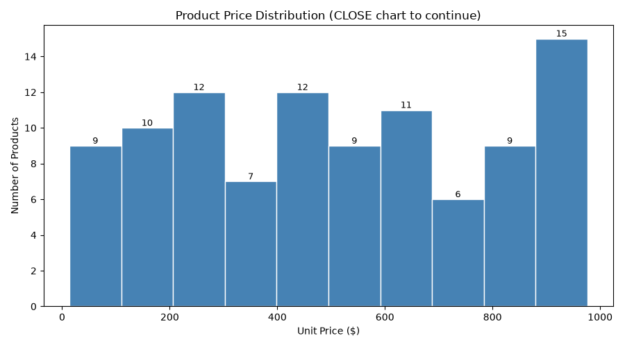

# Project Documentation

This site provides project documentation.
Use the documentation navigation to explore.

## How-To Guide

Many instructions are common to all our projects.

See
[⭐ **Workflow: Apply Example**](https://denisecase.github.io/pro-analytics-02/workflow-b-apply-example-project/)
to get the example projects running on your machine.

## Project Documentation Pages (docs/)

- **Home** - this documentation landing page
- [**Project Instructions**](./project-instructions.md)  - the standard project workflow
- [**Your Files**](./your-files.md) - how to copy the example and create your version
- [**Glossary**](./glossary.md) - project terms and concepts
- [**API**](./api.md) - autogenerated code documentation for the public project interface

## Phase 4. Technical Modification

The modifications that were made to this project, was the adding of the data labels onto the charts.

The main reason for this change was visulaization. Having the data on the chart gives it a better look, but also helps relay the information.

This change was confirmed when I ran the script, and the terminal let me know it has been exectuted. I knew it had been exectued because two new charts, with the data displayed appeared as popouts.

I found the change of adding the data to be challening, but also enlightening. I have become more comfortable with the coding language, which will hopefully help ease me into more

## Phase 5. Custom Project

Describe your custom data mining and exploration work.

### Basis and Data

This project consisted of three .csv files of raw data, below are my inital observations.
    customers_data.csv
    - **Initial Analysis:** This file consist of 4 columns Customer ID, Name, Region, and Join Date and has 202 rows.
    -  **Possible Quality Issues:** Name format is not consistent, Region format is not consistent
    products_data.csv
    - **Initial Analysis:** This file consist of 4 columns Product ID, Product Name, Category, and Unit Price and has 101 rows.
    -  **Possible Quality Issues:** Product names need to be verified
    sales_data.csv
    -  **Initial Analysis:** **This file consist of 7 columns Transaction, Sales Date, Customer ID, Product ID, Store ID, Campaign ID, and Sales Amount and has 2401 rows.
    -  **Possible Quality Issues:** Campaign column is not consist with several rows missing, due to number of row possibility of duplicates

### Mining Approach

Describe how you explored and visualized the data.

*I began by exploring the data provoided,writing down my inital observations of each file
*I went on to observe the charts that were loaded, while referring back to obsrervations
*I made the decision that labels on the charts would imporve the visualization of the data.

### Findings/Observations

Describe what you discovered about the smart sales data.

Two of my Observations
First observation is that the data provides gives us a clear look, as each is over a good amount of time.
    *Customer data shows join dates ranging from 2020 to 2025
    *Sales data shows sales for 2024 and 2025

Second observation there are major inconsitencies with formatting that can cause major grouping issues going down the roads.
    *Need to verigy duplicates for all to ensure accuracy
    *Customer data has inconsitencies with Names and Regions
    *Product data, the names on the prduct needs to be verified
    *Sales data there are missing spots under Campaign which can effect future results

**Observations Thoughts**
  In later modules wants to explore looking at forecasting and trends

### Ending Note

This project has me exploring three data sets by using pandas and matplotlib and building on what we learned last week from python and VS Code.

### Learning Note

This week I used what I learned from this exploration and reseach to add data labels on to the charts to better showcase their results.

### Real-Life Thoughts

In business setting the lessons learned this week will help aid in quality control. The reasons behind this thought is discovering how universial python and basic coding is.

### Images

